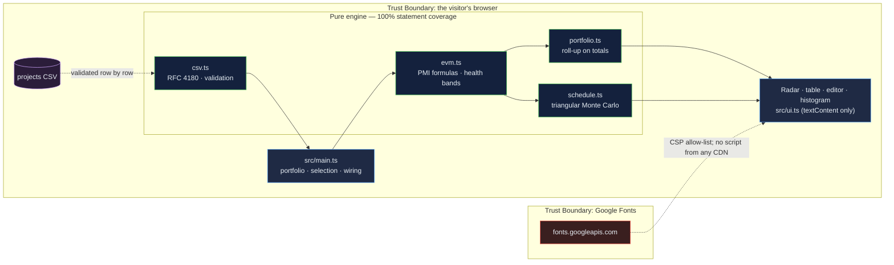

# Strategic Project Radar: earned value with the formulas on the page, and a finish date that is a distribution

[](https://github.com/Freddricklogan/strategic-project-radar/actions/workflows/deploy.yml)
[](#5-getting-started--verification)
[](https://github.com/Freddricklogan/strategic-project-radar/actions/workflows/codeql.yml)
[](LICENSE)
[](https://freddricklogan.github.io/strategic-project-radar/)

## 1. Executive Summary & Business Impact

**Problem statement.** Project status is reported as a colour someone chose.
"Amber" means whatever the project manager was willing to say that week,
and the finish date is a single number that has been wrong every time it
was reported. The arithmetic that would make status objective — earned
value — is forty years old and rarely run, because it lives in a training
course rather than in the tool the steering committee looks at.

**Solution & value delivered.** A portfolio radar that computes the
standard earned-value metrics — PV, EV, CPI, SPI, EAC, ETC, VAC, TCPI — from
four inputs per project, prints the formula beside every figure, bands
health at explicit thresholds, and rolls the portfolio up on totals rather
than averages. For the selected project a seeded Monte Carlo draws remaining
duration from the manager's own three-point estimate, stretched by the
observed schedule performance, and reports P10/P50/P90, the probability of
the planned date, and the contingency needed for 80% confidence. The sample
portfolio is six projects of the kind a university IT office runs.

**[→ Read the full case study](docs/CASE_STUDY.md)**

| Outcome | How this repo delivers it |
| --- | --- |
| Status that is arithmetic, not opinion | `evm()` implements the PMI formulas; a textbook case is pinned in tests (CPI 0.8, EAC $125k, TCPI 1.2) |
| Health you can argue with | Green / amber / red at 0.95 and 0.85 on the worse of CPI and SPI — constants, stated on screen |
| A finish date with a confidence level | `simulateSchedule()` — triangular draws from the three-point estimate, scaled by SPI, seeded and reproducible |
| A portfolio, not a list | Bubble radar (SPI × CPI × budget), roll-up on totals, expected overspend as the sum of negative VAC, strategic weight on green |
| Your projects | CSV import with row-level validation; export |

## 2. Demonstrated Competencies & Technical Skills

- **Systems Architecture & CS** — strict TypeScript; five pure modules with
  the arithmetic isolated from rendering; Vite build with no inline script
  so the strict CSP holds.
- **Data Science & AI** — an inverse-CDF triangular sampler checked for
  bounds and mean over 20,000 draws; percentile interpolation; a histogram
  with the planned date drawn on it so the reader sees the probability
  rather than reads it.
- **Cybersecurity & Compliance** — strict CSP, no CDN scripts, validated CSV
  import, `textContent`-only rendering; typed ESLint, CodeQL and Trivy in CI.
- **EdTech & Human-Centered Design** — built to teach the method from the
  Oxford Saïd programme on leading strategic projects: every metric carries
  its formula, the radar is keyboard-operable with a per-bubble accessible
  name, and the tour recovers a slipping project by editing one input.

## 3. System Architecture & Data Flow



## 4. Technical Highlights & Engineering Decisions

### ADR-1 — Print the formula beside the number

**Context.** Earned value fails in practice because the numbers arrive
without their derivation and nobody in the room can check them.

**Decision.** Every metric in the editor carries its formula as a caption
(`EAC = BAC ÷ CPI`, `TCPI = (BAC − EV) ÷ (BAC − AC)`), and the thresholds
the health bands use are exported constants shown in the panel text.

**Consequence.** A steering committee can dispute an input, not a colour;
the tests pin a textbook case so the implementation cannot drift from the
standard.

### ADR-2 — Stretch the three-point estimate by observed SPI

**Context.** A remaining-duration estimate given by the same person who was
wrong last month carries the same optimism. Pure three-point sampling
reproduces it.

**Decision.** Remaining draws are divided by SPI, capped to the range
0.5–1.5 so one bad month does not triple the estimate, and the adjustment is
a checkbox so the reader can see its effect.

**Consequence.** The LMS migration in the sample, 45% done against 60%
planned, reports a 0% chance of its planned week-40 finish and needs 15.8
weeks of contingency for 80% confidence — an honest number the plan did not
contain.

### ADR-3 — Roll up on totals, not averages

**Context.** Averaging six CPIs gives a small project the same weight as a
large one and hides the exposure.

**Decision.** Portfolio CPI and SPI are computed from summed EV, AC and PV;
expected overspend is the sum of negative VAC; "strategic weight on green"
weights health by each project's strategic weight.

**Consequence.** The portfolio's headline is the number the budget will
actually show, and the roll-up cannot be gamed by splitting a project.

## 5. Getting Started & Verification

**Prerequisites.** Node 22 LTS.

```bash
git clone https://github.com/Freddricklogan/strategic-project-radar.git
cd strategic-project-radar
npm install
npm run dev        # http://localhost:5173/strategic-project-radar/
npm run check      # lint → typecheck → validate → test → build
```

**Verification — the numbers this repository actually produced:**

```bash
npm test         # Test Files 4 passed (4) · Tests 18 passed (18)
npm run coverage # All files 100% statements · 93.12% branches
npm run lint     # eslint (typed) — clean
npm run typecheck# tsc --noEmit — clean
npm run validate # html-validate index.html — clean
npm run build    # dist: no inline script or style
```

| Check | Result |
| --- | --- |
| Unit tests | **18 passed / 18** across 4 files |
| Statement coverage (engine) | **100%** (branches 93.12%) |
| ESLint (type-checked), `tsc --noEmit`, html-validate | clean |
| Headless Chrome smoke (built site) | **0 console errors**; sample portfolio CPI 0.90, SPI 0.89, 3 red, expected overspend $323,444; LMS migration P10/P50/P90 finish 46.0/51.0/58.2 weeks on seed 42, 0.0% on plan, +15.8 weeks P80 contingency; tour step 4 moves it to 58% complete → SPI 0.97, portfolio CPI 0.96, red count 2; an out-of-range input is refused with a message; no horizontal scroll at 400 px |

## 6. Live Demo & Production Showcase

**<https://freddricklogan.github.io/strategic-project-radar/>**

No account, no backend. Sample portfolio, labelled as such.

**30-second guided walkthrough.** Press **Take the 30-second tour**.

1. **The portfolio on one chart** — SPI × CPI × budget, thresholds drawn.
2. **The formulas, not a colour** — the LMS migration's metrics, each with
   its formula.
3. **When will it really finish?** — the schedule distribution, on-plan
   probability and P80 contingency.
4. **Recover the schedule** — one input changes; everything recomputes.
5. **The portfolio roll-up** — totals, exposure, strategic weight on green.

Then edit any input, change the seed, or import your own projects.
